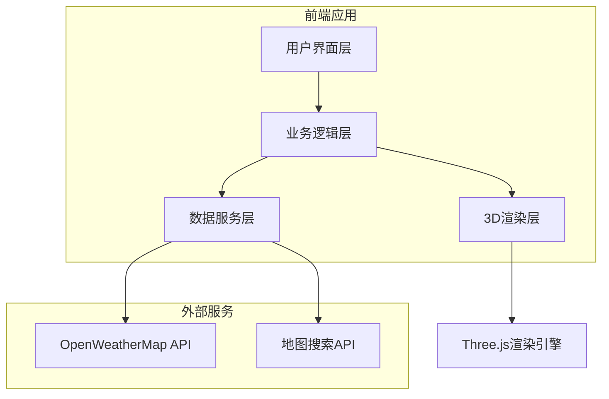

# 高级天气预报系统 需求规格说明书

## 1. 产品概述
高级天气预报系统是一款基于3D地球模型的交互式天气可视化平台，通过实时渲染的地球模型，让用户可以通过旋转、放大、倾斜等操作直观了解全球各地的天气状况。系统融合了传统天气预报功能与现代3D可视化技术，为用户提供沉浸式的天气查询体验。

### 1.1 核心价值
- **直观可视化**：通过3D地球模型和动态天气效果，让天气数据更加直观易懂
- **全球视角**：提供全球范围内的天气状况，帮助用户理解天气系统的空间关系
- **交互体验**：支持用户通过操作地球模型自主探索不同地区的天气信息
- **多维度分析**：提供温度、降水、风速等多种天气数据维度的展示

### 1.2 目标用户
- **普通用户**：关注日常天气变化，希望获得直观、美观的天气信息
- **旅行爱好者**：需要了解全球不同地区的天气状况，为旅行计划提供参考
- **气象爱好者**：对天气系统有深入兴趣，希望通过可视化方式了解全球天气格局
- **教育工作者**：可作为气象教育的辅助工具，帮助学生理解天气现象

## 2. 功能需求（Functional Requirements）

| 功能ID | 功能名称 | 功能描述 | 优先级 |
|--------|---------|---------|--------|
| FR001 | 3D地球模型 | 实时渲染高精度地球模型，支持旋转、缩放、倾斜操作，模拟真实地球自转和公转 | 高 |
| FR002 | 全球天气数据可视化 | 在地球模型上以颜色渐变、动态粒子、云层效果等方式展示全球各地的温度、降水、风速等天气数据 | 高 |
| FR003 | 区域天气详情 | 点击地球任意位置，显示该区域的详细天气信息，包括温度、湿度、气压、风向、天气状况等 | 高 |
| FR004 | 天气趋势预测 | 提供24小时、7天、30天的天气趋势预测，支持时间轴拖动查看不同时间点的天气状况 | 高 |
| FR005 | 极端天气预警 | 实时显示全球极端天气事件，如台风、暴雨、高温等，并提供预警信息 | 中 |
| FR006 | 多维度数据展示 | 支持切换不同天气数据维度，如温度、降水、风速、气压等 | 中 |
| FR007 | 个性化设置 | 允许用户保存常用地点，设置默认视图和数据展示偏好 | 中 |
| FR008 | 地点搜索 | 支持通过关键词搜索全球城市，快速定位到指定地点查看天气 | 中 |
| FR009 | 昼夜交替效果 | 根据真实时间和地理位置，在地球模型上展示昼夜交替效果 | 低 |
| FR010 | 数据导出 | 支持导出天气数据和地球视图截图 | 低 |

## 3. 非功能需求（Non-Functional Requirements）

| 需求ID | 需求名称 | 需求描述 | 优先级 |
|--------|---------|---------|--------|
| NF001 | 性能要求 | 地球模型渲染帧率不低于30fps，数据更新响应时间不超过1秒，支持主流设备流畅运行 | 高 |
| NF002 | 兼容性 | 支持Chrome、Firefox、Safari、Edge等主流浏览器，支持PC端和移动端适配 | 高 |
| NF003 | 数据准确性 | 天气数据来源权威可靠，实时数据更新频率不低于15分钟一次 | 高 |
| NF004 | 安全性 | 采用HTTPS协议，保护用户数据隐私，不存储用户位置等敏感信息 | 中 |
| NF005 | 可扩展性 | 系统架构支持未来功能扩展，如添加空气质量、花粉浓度等数据维度 | 中 |
| NF006 | 可用性 | 系统可用性达到99.9%，支持离线访问基本功能 | 中 |
| NF007 | 响应式设计 | 适配不同屏幕尺寸，在移动设备上提供良好的用户体验 | 中 |

## 4. 技术方案

### 4.1 技术栈选择

| 技术领域 | 技术选型 | 版本要求 | 选型理由 |
|---------|---------|---------|---------|
| 前端框架 | React + TypeScript | React 18+ | 组件化开发，类型安全，生态完善，适合复杂交互应用 |
| 3D渲染 | Three.js | 0.150+ | 成熟的WebGL库，性能优异，社区活跃，支持复杂3D场景渲染 |
| 状态管理 | Redux Toolkit | 1.9+ | 管理复杂的应用状态，如用户设置、天气数据缓存等 |
| 样式方案 | TailwindCSS | 3.0+ | 快速构建响应式界面，自定义主题支持 |
| 天气数据API | OpenWeatherMap API | v3.0+ | 全球覆盖，数据准确，接口稳定，支持免费和付费套餐 |
| 构建工具 | Vite | 4.0+ | 快速的开发服务器和构建工具，支持热更新 |
| 部署方案 | Vercel | - | 支持静态网站托管，CDN加速，自动部署 |

### 4.2 系统架构

### 4.3 核心模块设计

| 模块名称 | 主要职责 | 技术实现 | 文件位置 |
|---------|---------|---------|---------|
| 地球渲染模块 | 3D地球模型渲染、天气数据可视化 | Three.js、ShaderMaterial | src/components/EarthModel/ |
| 天气数据模块 | 天气API调用、数据处理、缓存管理 | Axios、IndexedDB | src/services/weather/ |
| 交互控制模块 | 地球操作控制、事件处理 | React hooks、事件监听器 | src/components/Controls/ |
| 用户设置模块 | 用户偏好管理、本地存储 | localStorage | src/services/settings/ |
| UI组件模块 | 界面元素、响应式布局 | React、TailwindCSS | src/components/UI/ |

## 5. 数据需求

### 5.1 数据来源

| 数据类型 | 来源 | 接口地址 | 更新频率 |
|---------|---------|---------|---------|
| 全球天气数据 | OpenWeatherMap API | https://api.openweathermap.org/data/2.5/ | 15-30分钟 |
| 地球纹理数据 | 静态资源 | 本地CDN | 按需加载 |
| 地点搜索数据 | OpenWeatherMap Geocoding API | https://api.openweathermap.org/geo/1.0/ | 实时 |

### 5.2 数据结构

| 数据类型 | 字段 | 类型 | 描述 |
|---------|---------|---------|---------|
| 天气数据 | id | string | 城市ID |
|  | name | string | 城市名称 |
|  | coord | object | 经纬度坐标 |
|  | weather | array | 天气状况 |
|  | main | object | 主要天气数据（温度、湿度、气压） |
|  | wind | object | 风速风向 |
|  | dt | number | 时间戳 |
| 用户设置 | savedLocations | array | 保存的地点列表 |
|  | defaultView | object | 默认视图设置 |
|  | dataPreferences | object | 数据展示偏好 |
|  | theme | string | 主题设置 |

## 6. 用户界面设计

### 6.1 界面布局

| 区域 | 功能 | 位置 | 设计要求 |
|---------|---------|---------|---------|
| 地球视图 | 3D地球模型展示 | 全屏 | 占据主要屏幕空间，支持鼠标拖拽旋转、滚轮缩放 |
| 控制面板 | 功能控制 | 右侧或底部 | 包含数据维度选择、时间轴控制、地点搜索等功能 |
| 天气详情面板 | 详细天气信息 | 弹出式 | 点击地球位置后弹出，显示该区域详细天气信息 |
| 预警信息 | 极端天气预警 | 顶部 | 以醒目方式显示全球极端天气预警 |
| 加载状态 | 加载提示 | 中心 | 提供清晰的加载动画和进度提示 |

### 6.2 交互设计

| 交互类型 | 操作方式 | 响应 |
|---------|---------|---------|
| 地球旋转 | 鼠标拖拽或触摸滑动 | 地球模型跟随鼠标/触摸移动旋转 |
| 地球缩放 | 鼠标滚轮或双指捏合 | 地球模型缩放，调整视图范围 |
| 地球倾斜 | 按住Shift键拖拽或双指旋转 | 地球模型倾斜，调整视角 |
| 地点点击 | 点击地球表面 | 弹出该地点的天气详情面板 |
| 时间轴拖动 | 拖拽时间轴滑块 | 地球模型显示对应时间的天气状况 |
| 数据维度切换 | 点击数据维度按钮 | 地球模型切换显示对应数据维度 |

## 7. 开发计划

### 7.1 项目阶段

| 阶段 | 时间 | 主要任务 | 交付物 |
|---------|---------|---------|---------|
| 需求分析与设计 | 2周 | 完成需求规格说明书，确定技术方案和系统架构 | 需求规格说明书、技术架构文档 |
| 核心功能开发 | 6周 | 实现地球渲染模块、天气数据模块、交互控制模块的核心功能 | 核心功能代码、单元测试 |
| UI/UX实现 | 3周 | 开发用户界面，实现响应式设计和交互优化 | 完整的用户界面、交互原型 |
| 测试与优化 | 2周 | 性能测试、兼容性测试、用户体验优化 | 测试报告、优化方案 |
| 部署与上线 | 1周 | 系统部署、监控设置、文档编写 | 上线版本、用户手册 |

### 7.2 关键里程碑

1. **地球模型渲染**（第2周）：完成基础地球模型渲染，支持旋转和缩放操作
2. **天气数据集成**（第4周）：实现天气API对接，在地球模型上显示天气数据
3. **交互功能完善**（第6周）：完成时间轴控制、地点搜索等交互功能
4. **性能优化**（第8周）：实现渲染性能优化，确保在不同设备上流畅运行
5. **系统上线**（第10周）：完成最终测试，部署上线并收集用户反馈

## 8. 风险评估

| 风险ID | 风险描述 | 影响程度 | 概率 | 应对措施 |
|---------|---------|---------|---------|---------|
| R001 | 3D渲染性能问题 | 高 | 中 | 实现LOD技术，根据设备性能自动调整渲染质量，使用WebWorker处理数据计算 |
| R002 | 天气API调用限制 | 中 | 高 | 实现智能缓存策略，减少API调用频率，考虑使用多个API数据源作为备份 |
| R003 | 移动端兼容性 | 中 | 中 | 针对不同移动设备进行适配测试，实现响应式设计和触摸优化 |
| R004 | 数据加载延迟 | 中 | 中 | 实现渐进式加载，先显示低分辨率数据，再逐步加载高分辨率数据 |
| R005 | 浏览器兼容性 | 低 | 低 | 使用Babel和Polyfill确保代码在不同浏览器中正常运行，定期进行兼容性测试 |

## 9. 验收标准

| 功能ID | 验收说明 | 测试方法 |
|---------|---------|---------|
| FR001 | 地球模型可流畅旋转、缩放、倾斜，无卡顿现象 | 手动操作测试，性能监控 |
| FR002 | 天气数据在地球模型上正确显示，颜色渐变自然，动态效果流畅 | 功能测试，视觉效果评估 |
| FR003 | 点击地球任意位置，正确显示该区域的详细天气信息 | 功能测试，数据准确性验证 |
| FR004 | 时间轴拖动时，天气数据正确更新，趋势预测准确 | 功能测试，数据对比验证 |
| FR005 | 极端天气事件在地球模型上醒目显示，预警信息准确 | 功能测试，模拟数据验证 |
| FR006 | 切换不同数据维度时，地球模型显示对应数据，切换过程流畅 | 功能测试，用户体验评估 |
| FR007 | 用户设置可正确保存和加载，个性化偏好生效 | 功能测试，本地存储验证 |
| NF001 | 在主流设备上，地球模型渲染帧率不低于30fps | 性能测试，帧率监控 |
| NF002 | 在Chrome、Firefox、Safari、Edge等浏览器上正常运行 | 兼容性测试 |
| NF003 | 天气数据与官方数据源一致，更新及时 | 数据准确性测试，更新频率验证 |

## 10. 结论与建议

基于以上分析，开发高级天气预报系统技术上是可行的，具有良好的用户体验和市场潜力。系统采用Three.js等成熟技术，结合权威的天气数据API，可以实现用户通过旋转、放大地球模型来直观了解全球各地天气状况的核心功能。

### 建议：
1. **优先实现核心功能**：先完成3D地球模型渲染和基本天气数据可视化，确保系统的核心价值得以体现
2. **注重性能优化**：在开发过程中持续关注性能问题，确保系统在不同设备上都能流畅运行
3. **数据缓存策略**：设计合理的数据缓存机制，减少API调用频率，提高系统响应速度
4. **用户体验测试**：在开发过程中进行用户体验测试，收集反馈并持续优化
5. **商业模式规划**：提前规划商业模式，考虑免费版和付费版的功能差异化，确保系统的可持续发展

通过合理的技术架构设计和开发计划，可以打造一款具有创新性和实用性的高级天气预报系统，为用户提供全新的天气查询体验。